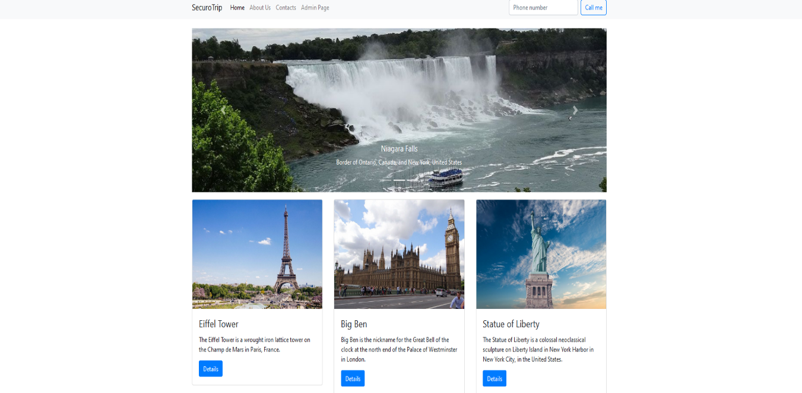
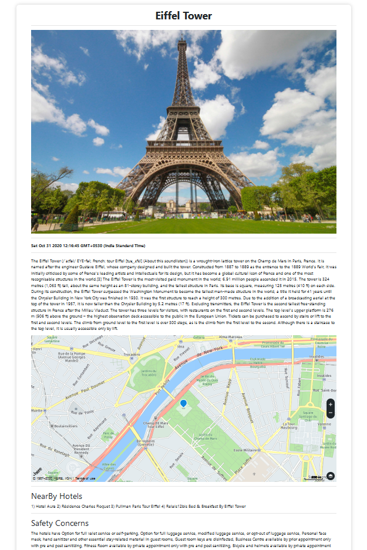
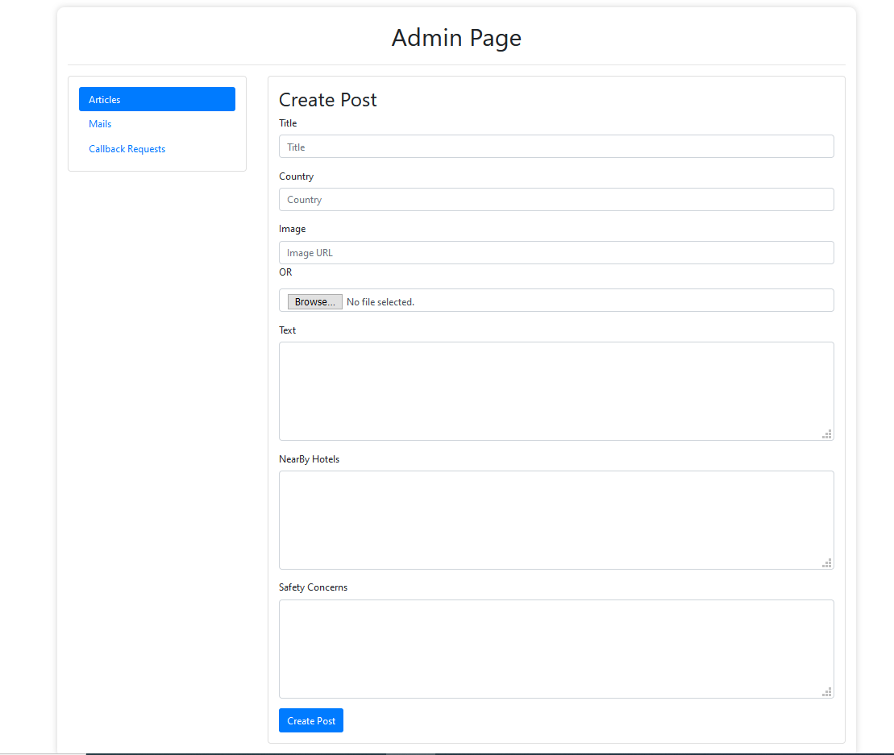
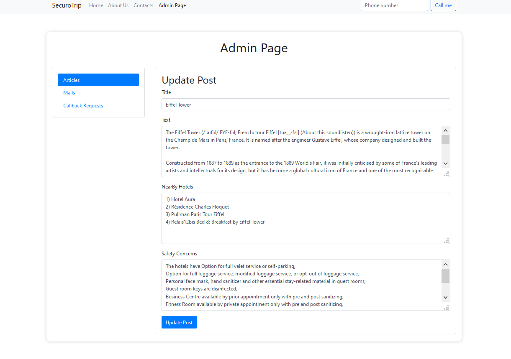

# SecuroTrip
SecuroTrip is a Tours and Travels based website that let clients travel to the desired destinations with all COVID-19 precautions besides making privacy a primary concern.
It allows the client to contact the admins of the website after finalizing the destination and provide their contact information which is then forwarded to the tourism spot’s tour and travels agencies, which can then contact the client and give them choices to choose from,
as well as the current Covid situation. 
Tourist guides will be registered with Government of India which guarantees a satisfactory experience.
The project is made up of Node JS which provides a environment secure with very less load and access time. The data and personal information are protected from leaks and database attacks y encryption and decryption for the admin page which protects the data
even from the creator of the website. 
Customer requests are handles using “CRUD” operations in MongoDB. HTML and CSS are used to build and design the website.
Bootstrap and Express JS are used for front end and back end framework respectively.
Rest API allows updation of website in real time and AJAX enables asynchronous updation of webpage. EJS links JavaScript and HTML for creating templates. 
It can be referred as a “Plug and Play Project” which can later be converted into desktop or mobile application at higher extent.
It'll help local tour and travel agencies that lack widespread audiences, gain said audiences
by enabling businesses to go online reaching customers, further boosting their business capabilities.
It’ll also help in booming the Tourism Industry of a country by directing tourist traffic to places of which people might not have heard of, and may also give a new life to these spots.

  
<!--    -->

<h2 align="center">Home Page</h2>
  

  
<!--    -->

<h2 align="center">Destination With Map</h2>
  

  
<!--    -->

<h2 align="center">Create Post</h2>
  

  
<!--    -->

<h2 align="center">Update Post</h2>
